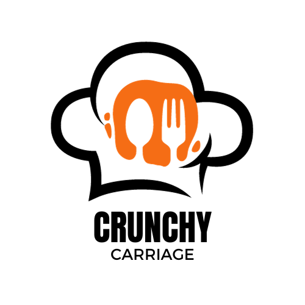

## Crunchy Carriage

Crunchy Carriage is a restaurant and Food delivery service. It is a web application that allows users to order food from the comfort of their homes.

#### Technologies

- Typescript
- next.js 14
- TailwindCSS
- zustand
- react-query
- react-hook-form
- shadcn & Radix-UI

##### Features

- Users can view the menu and order food
- Users can make reservations
- Users can view their order and reservations history
- Users can view their profile and update their profile
- Admin can view all orders, reservations and edit or delete food items
- more, coming soon
